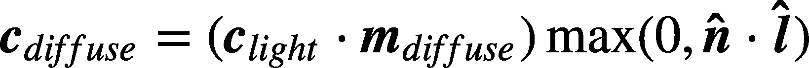
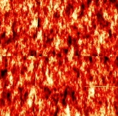
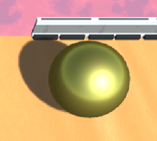

**The University of Melbourne**
# COMP30019 – Graphics and Interaction

## Teamwork plan/summary

<!-- [[StartTeamworkPlan]] PLEASE LEAVE THIS LINE UNTOUCHED -->

<!-- Fill this section by Milestone 1 (see specification for details) -->

Here you should be discussing how you will be delegating tasks among team members, as well
as protocols and processes you will use to keep the project organised. Keep it updated 
throughout the duration of the project. By the final submission it should contain 
a summary of who completed what. (You should of course remove and replace this paragraph!)

Liangdongfang Xu(team leader)

Fix bugs for teammates code. Unity object textures. Unity object connections.

Chengyi Huang

Create scenes, add lightings and shadings. Create props and mobs.

Hecheng Yin

Character hitboxes, movements, damage roll.

Jinbiao Wang

Researching relevent resources on the internet (unity assets...). Implementing game logic.

<!-- [[EndTeamworkPlan]] PLEASE LEAVE THIS LINE UNTOUCHED -->

## Final report

Read the specification for details on what needs to be covered in this report... 

Remember that _"this document"_ should be `well written` and formatted **appropriately**. 
Below are examples of markdown features available on GitHub that might be useful in your report. 
For more details you can find a guide [here](https://docs.github.com/en/github/writing-on-github).

### Table of contents
* [Game Summary](#game-summary)
* [Gameplay instruction](#gameplay-instruction)
* [High level gameplay design decisions](#High-level-gameplay-design-decisions)
* [Custom shaders](#custom-shaders)
* [Procedural generation technique](#Procedural-generation-technique)
* [Particle system](#Particle-system)
* [Querying technique & observational method](#Querying-technique-&-observational-method)

### Game Summary
**Genre:** Third person shooter 

**General Premise:** The character uses gun to survive by killing the monsters and achieve higher scores. 

**Storyline:** The character is dispatched to an alien planet which is inhabitat by ghosted monsters for a star war to save his homeland. The more monsters eliminated, the more probability his home planet will be saved.

### Gameplay instruction:
**How to play the game:** There are two modes in our game:

**Tutorial mode:** Introduce the background story of the game and the instruction on game operation. The player can finish the tutorial by wiping out all the monsters.  

**Survival mode:** Kill as many monsters as you can to achieve higher scores, using the dropped random props when monsters die as Auxiliary tools. 

### High level gameplay design decisions
Since the theme of our game is based in outer space, the graphical assets that we chose tend to look more futuristic, say the main character is dressed in robotic armour and the scene imitates the look of a space station. We decided that the texture of the objects should look cartoonish to give the gameplay a more relaxed and light hearted feeling. We decided that the enemies should use melee attack while the player controlled character attacks by shooting, this way the gameplay difficulty is moderate and the overall actions look organised. The camera angle is fixed above the player, this way the player can be more aware of the surroundings (see the random loot, incoming enemies easily).

### Custom shaders
We’ve made use of three HLSL shaders in our project: **lambert.shader**, **lava.shader** and **metalButton.shader** (Lava and metal shader to be marked). The lambert shader we used is for the lighting of the gameplay ground (red tile). The lamber model we used is a simple diffuse model that assumed the incident light was reflected equally in all directions when rendered

  

Thus the red tile ground in the tutorial scene has a relatively matte appearance compared to other material in the game.

The lava shader we used is to give a wavy effect to the lava like material on the floor. The y position of  the lava tile is a sin function that moves as the game time progresses, giving it a consistent wave vertically, the texture UV also moves horizontally with time.

  

The metalButton shader is to give a metallic appearance to the two metal balls in the tutorial scene. The metal shader made use of fresnel model to simulate lighting on metals:
Output = (1-Fresnel) * LambertDiffuse + Fresnel * (Specular + Ambient)
In the specular part, the metal ball only reflects lighting that’s similar to its own colour.

  

### Procedural generation technique
In challenge mode, we use a script(MapManager.cs) to make the map randomly generated. When the player selects the challenge mode, the map will be different. In the script, we need to set the size of the map. An n x n matrix is generated based on the Map size. Then loop each coordinate and a random number between 0 and 20 is generated at each coordinate, if the random number is less than 10 then a type 1 building is generated, if it is greater than or equal to 10 then a type 2 building is generated. A variety of different building models are stored in each type of building, and one building from a type is randomly selected for generation each time. Each coordinate point in the matrix is just the initial generation coordinate of the building, and an offset value is randomly generated before the building is generated. The initial generated coordinates of the building plus the offset value are the actual generated coordinates of the building. After traversing each coordinate point of the matrix, a random map is created. Regarding monster generation, the script will continuously update the player's coordinates and will randomly generate monsters in one of the four directions of the player's up, down, left, right.

### Particle system
**die particle 2.prefab:** Using particle system to simulate the blood explosion when a monster is destroyed by the bullet. 

* According to the physical system, the blood should align with the incident direction of the bullets when monsters are destroyed, therefore the particles will burst out with the same direction of the incoming bullets.  

* Under the render parameter, the render mode is set to mesh as simulating the shape of blood. 

* Disable the looping function as blood only bursts once when enemies are destroyed. 

* Randomness: In the real world, the direction, size and speed of the splashing blood drop tend to have randomness. Therefore, to improve the sense of reality, the start speed and the start size of the particles are set at random between two constants. 

* Attach a gravity component as the blood will finally drop down to the ground by including the gravity modifier with value of 1.

* To simulate burst of the blood, add the “Bursts” attribute under component “Emission” and get rid of rate over time as blood will spread together at the same time. Decreasing the angle of the cone shape makes the blood burst concentrated. “Size over Lifetime” is used as the shape of the blood decreases as the time goes by. 

* Colour over lifetime is used to create the effect of blood gradually disappearing.

### Querying technique & observational method
Below is a link to the querying/observational technique we used to improve our game:
[Gameplay survey](https://docs.google.com/document/d/18Ao7ugqCcHGAlTMqoL06vCr4k77FTUyQrvwCm6YRIUE/edit)

###  Changes made based on the evaluation
* Background sound modified 
* Step sound played at the beginning of the game bug fixed 
* The visualization of the user interface is modified and is more pleased to the eye
* Plot added to give a general view of the background story of our game 
* The issue of props may disappear have been fixed 
* The types of gun is recuded to single 
### References
1. https://www.bilibili.com/video/BV1H5411s7W8/?spm_id_from=333.999.0.0&vd_source=0552ed181e67761f2b92eb1d19da96d9

2. https://www.bilibili.com/video/BV1TK4y1e7vF/?spm_id_from=333.337.search-card.all.click&vd_source=2f4e3f3763d95f055fe47692f33d227a

3. https://docs.unity3d.com/ScriptReference/Transform.Rotate.html

4. https://www.youtube.com/watch?v=IRAeJgGkjHk&t=15s

5. https://www.youtube.com/watch?v=6U_OZkFtyxY&t=284s

6. https://www.youtube.com/watch?v=6OT43pvUyfY
